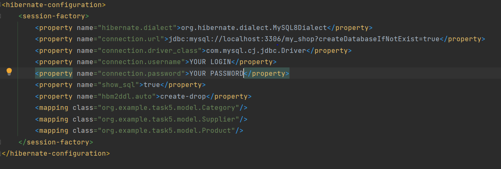

# Project Name: Coding Challenges Solutions
This repository contains solutions to various coding challenges. Below are the details of each task and how to run them.

### Task 1: Rail Fence Cipher (Encoding and Decoding)
#### Description:
* The Rail Fence Cipher is used to encode and decode a string by placing each character successively in a diagonal along a set of "rails".
* A function <B>encodeRailFenceCipher(String input, int rails)</B> encodes a string.
* A function <B>decodeRailFenceCipher(String encoded, int rails)</B> decodes an encoded string.
### Task 2: Print a New Number with Digit Transformation
#### Description:
* A function <B> transform(int number)</B> takes a number and prints a new number by adding one to each of its digits.
* If a 9 is encountered, it inserts a 10.
### Task 3: Validate Sudoku with Size NxN
#### Description:
* A function <B>validateSudoku(List<List<Integer>> sudoku)</B> validates if a Sudoku puzzle of size NxN has been filled out correctly.
* The data structure is a multi-dimensional List (List<List<Integer>>).
* It checks if each number appears once in each row, column, and small square of the Sudoku.
### Task 4: Sortable Shapes
#### Description:
* Four different shapes (Square, Rectangle, Triangle, Circle) can be sorted by the size of their areas.
* A default sort order of a list of shapes is ascending based on the area size.
### Task 5: Database 'MyShop' and Queries
#### Description:
* Created a database 'MyShop' with three tables: 'Products', 'Categories', and 'Suppliers'.
* Populated the tables with data.
* Executed several HQL queries to retrieve information from the database.
## How to Run:
Each task has its own set of functions or classes.
To test these functions, you can execute them in your preferred coding environment.

### Prerequisites:

Make sure you have MySQL installed and running on your local machine.
Download the archive from GitHub and extract it to your local directory.
#### Step 1: Configure hibernate.cfg.xml

Open the hibernate.cfg.xml file in the project directory and configure it as follows:

* Ensure that the connection.url property points to your MySQL server's URL (e.g., localhost:3306).
* Modify the connection.username and connection.password properties with your MySQL username and password.
* Set show_sql to true if you want to see HQL queries in the console.
####  Step 2: Testing the Solutions

Navigate to the root directory of the project where you extracted the archive and locate the solutions for each task. Typically, each task has a corresponding class or function.

* Compile and run each task's solution class or function in your preferred Java development environment.

#### Step 3: Reviewing Query Results

For Task 5, which involves a database, you can review the results of the HQL queries by checking the console. If you set <B> show_sql</B> to <B>true</B> in the <B>hibernate.cfg.xml</B> file, Hibernate will print the executed SQL queries to the console. This will allow you to see the results of the database operations.

#### Step 4: Troubleshooting

If you encounter any issues or errors during testing, double-check the database configuration in <B>hibernate.cfg.xml</B> and ensure that your MySQL server is running. Additionally, verify that you have the necessary dependencies and libraries configured in your Java development environment.

Feel free to reach out if you encounter any specific issues or need further assistance with testing the solutions.